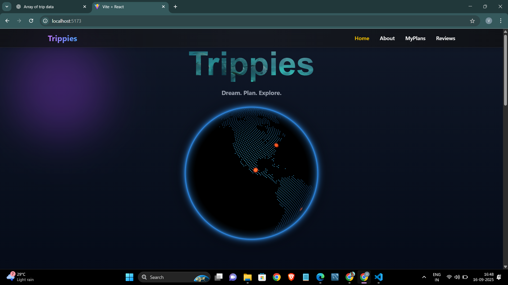

# 🌍 Trippies – Plan, Explore, Relive Your Journeys  

[](screenshots/home-globe.png)  

**🔗 Live Demo:** [Trippies on Vercel](https://trippies.vercel.app/)  

Trippies is a modern travel planning app built with **React** and **Vite**. Effortlessly discover destinations, organize trips, and share experiences with a beautiful, interactive UI.  

---

## ✨ Features  

- 🌐 **Explore Destinations:** Interactive globe and image galleries.  
- 📅 **Smart Planning:** Add, edit, and manage trips with ease.  
- 👨‍👩‍👧‍👦 **Group Coordination:** Plan with friends and family.  
- ⭐ **Trusted Reviews:** Real traveler feedback.  
- 🎨 **Modern UI:** Responsive, animated, and visually stunning.  
- 🔔 **Real-Time Feedback:** Smooth notifications with Hot Toast.  

---

## 🚀 Screenshots  

### Home Page – Dream. Plan. Explore.  
  

### Why Choose Trippies?  
.png)  

### Explore Destinations  
.png)  

### Reviews  
.png)  

### All Trips  
.png)  

### Add a New Trip  
.png)  

### More UI Highlights  
.png)  
.png)  
.png)  
.png)  
.png)  

---

## 🛠️ Tech Stack  

- ⚛️ **React 19**  
- ⚡ **Vite**  
- 🎨 **Tailwind CSS**  
- 🌀 **Framer Motion** for animations  
- 🛣️ **React Router** for navigation  
- 🔔 **React Hot Toast** for notifications  

---

## 📦 Getting Started  

Clone the repository and install dependencies:  

```sh
git clone https://github.com/your-username/trippies.git
cd trippies
npm install
npm run dev
